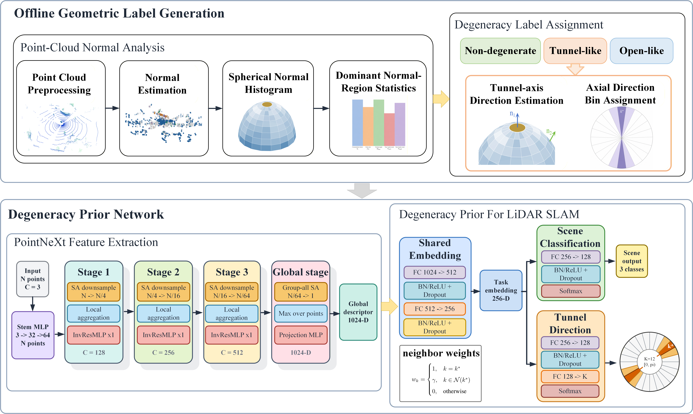
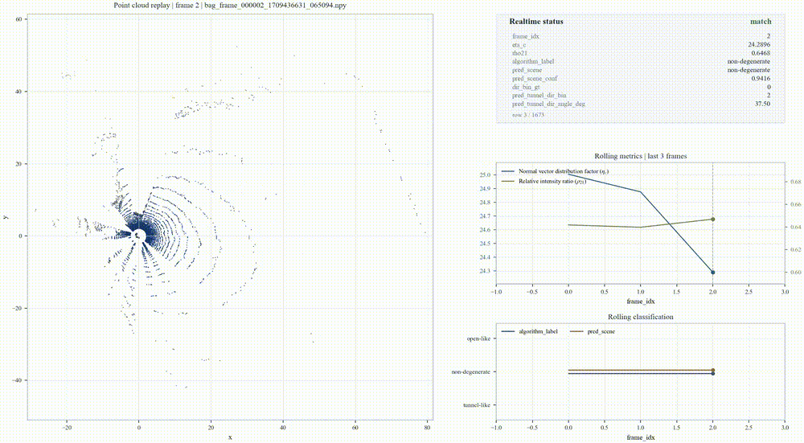
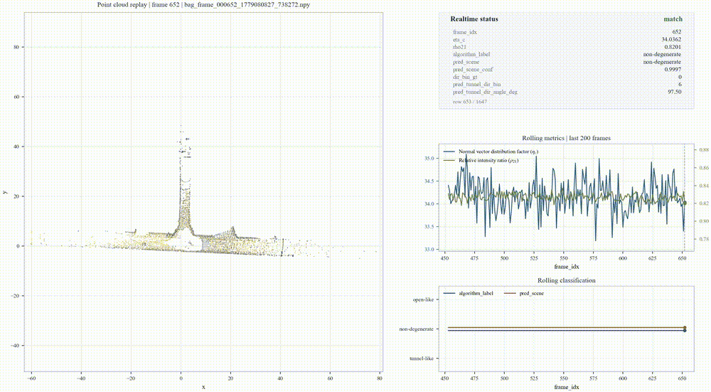

# Scene-Conditioned LiDAR Degeneracy Prediction With Geometric Statistical Label Generation

[]()
[]()
[]()

This repository contains the implementation of **Scene-Conditioned LiDAR Degeneracy Prediction With Geometric Statistical Label Generation**. The method predicts scene-level LiDAR degeneracy from a single point cloud and estimates the tunnel-axis direction for tunnel-like scenes.

Paper: coming soon

## Overview

<p align="center">
  
</p>

The pipeline contains two parts: offline geometric label generation and an online degeneracy prior network. The offline stage generates scene degeneracy labels and tunnel-axis direction labels from point-cloud geometric statistics. The online stage uses a PointNeXt backbone to predict the degeneracy state and direction prior from a single LiDAR scan.

## Demo

The replay dashboard shows the input point cloud, geometric statistics, predicted scene label, and direction-bin output.

### Open-like / non-degenerate sequence replay

<p align="center">
  
</p>

### Tunnel-like sequence replay

<p align="center">
  
</p>

## Highlights

- Geometric statistical label generation for LiDAR degeneracy scenes.
- Three-class scene prediction: tunnel-like, open-like, and non-degenerate/other.
- Tunnel-axis direction prediction using axial direction bins.
- Circular neighbor-weighted direction supervision for axial bin classification.
- PointNeXt-based single-frame point-cloud inference.

## Installation

Please install PyTorch according to your CUDA environment from the official PyTorch instructions.

```bash
git clone https://github.com/fgly/scene-conditioned-lidar-degeneracy.git
cd scene-conditioned-lidar-degeneracy

conda create -n degnet python=3.9 -y
conda activate degnet

pip install -r requirements.txt
```

## Dataset Organization

The dataset is not included in this repository. Prepare point clouds and labels locally, then pass the label table with `--label_path` and the data root with `--data_root`.

A typical layout is:

```text
dataset_root/
|-- labels/
|   `-- deg_scene_labels.csv
`-- point_clouds/
    |-- frame_000001.npy
    |-- frame_000002.npy
    `-- ...
```

Point-cloud paths in the label table may be absolute or relative to `--data_root`. Supported point-cloud formats include `.npy`, `.npz`, `.txt`, `.csv`, `.pts`, `.xyz`, `.bin`, `.pkl`, and `.pickle`; the first three columns are used as xyz coordinates unless feature channels are enabled.

Example:

```csv
file_path,split,scene_type,dir_x,dir_y,dir_xy_valid,dir_bin_gt,dir_bin_valid
point_clouds/frame_000001.npy,train,tunnel_like,1.0,0.0,1,0,1
point_clouds/frame_000002.npy,val,open_like,0.0,0.0,0,0,0
point_clouds/frame_000003.npy,test,nondeg_or_other,0.0,0.0,0,0,0
```

## Pretrained Model

The released PointNeXt checkpoint is placed at:

```text
log/deg_scene/smoke_pointnext_bs8_ep2/checkpoints/best_model.pth
```

The directory also contains the corresponding evaluation logs:

```text
log/deg_scene/smoke_pointnext_bs8_ep2/
|-- checkpoints/
|   `-- best_model.pth
|-- eval_test_metrics.json
|-- eval_val_results.txt
|-- train.log
`-- README.md
```

## Quick Start

### Smoke test

```bash
python tools/smoke_test_deg_scene.py
```

### Evaluate the released checkpoint

```bash
python test_deg_scene.py \
  --label_path path/to/labels/deg_scene_labels.csv \
  --data_root path/to/dataset_root \
  --log_dir smoke_pointnext_bs8_ep2 \
  --backbone pointnext \
  --num_point 2048 \
  --input_channel 3 \
  --use_uniform_sample \
  --use_cpu
```

`--log_dir smoke_pointnext_bs8_ep2` resolves to `log/deg_scene/smoke_pointnext_bs8_ep2/checkpoints/best_model.pth`. You can also pass an explicit checkpoint with `--checkpoint`.

### Inference on a single PCD

```bash
python infer_deg_scene_pcd.py \
  --pcd path/to/example.pcd \
  --checkpoint log/deg_scene/smoke_pointnext_bs8_ep2/checkpoints/best_model.pth \
  --backbone pointnext \
  --num_point 2048 \
  --use_cpu
```

## Training

```bash
python train_deg_scene.py \
  --label_path path/to/labels/deg_scene_labels.csv \
  --data_root path/to/dataset_root \
  --num_point 2048 \
  --batch_size 8 \
  --epoch 100 \
  --input_channel 3 \
  --backbone pointnext \
  --use_uniform_sample \
  --num_dir_bins 12 \
  --learning_rate 0.0003 \
  --lambda_cls 0.5 \
  --lambda_mag 0.2 \
  --lambda_tun 2.0 \
  --lambda_rz 0.2 \
  --lambda_lock 0.1 \
  --dir_bin_smoothing 0.2 \
  --log_dir pointnext_run
```

Training logs and checkpoints are written to `log/deg_scene/<log_dir>/`.

## Geometric Label Generation

| Script | Description |
|---|---|
| `tools/bag_degeneracy_labeler.py` | Generate degeneracy labels from ROS1 bag PointCloud2 frames using point-cloud geometric statistics. |
| `tools/build_scene_direction_pseudo_labels.py` | Build scene and tunnel-axis direction pseudo labels from a point-cloud file list. |
| `tools/check_dir_bin_mapping.py` | Check axial direction-bin mapping and label consistency. |
| `tools/plot_deg_dataset_figs.py` | Visualize label statistics and diagnostic figures. |
| `tools/augment_deg_dataset_rotate_z.py` | Apply z-axis rotation augmentation while keeping label consistency. |


## Repository Structure

```text
.
|-- assets/                  # Framework and demo figures for README
|-- data_utils/              # Dataset and point-cloud loading utilities
|-- models/                  # PointNeXt backbone and degeneracy prediction heads
|-- tools/                   # Label generation and smoke-test tools
|-- utils/                   # Metrics and helper functions
|-- log/deg_scene/           # Released checkpoint and evaluation logs
|-- train_deg_scene.py       # Training entry
|-- test_deg_scene.py        # Evaluation entry
|-- infer_deg_scene_pcd.py   # Single-frame PCD inference entry
|-- requirements.txt
`-- README.md
```

## Citation

If you find this repository useful, please cite:

```bibtex
@misc{scene_conditioned_lidar_degeneracy,
  title  = {Scene-Conditioned LiDAR Degeneracy Prediction With Geometric Statistical Label Generation},
  author = {Waiting},
  year   = {2026},
  note   = {Code available at https://github.com/fgly/scene-conditioned-lidar-degeneracy}
}
```

## Acknowledgements

This implementation uses a PointNeXt-style point-cloud backbone. The manuscript experiments use GEODE samples.

## License

This project is released under the MIT License. See [LICENSE](LICENSE).
